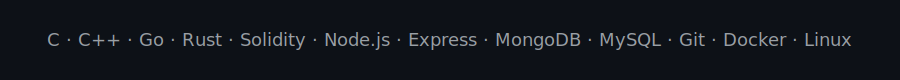

<!-- Self-hosted, reliable README (dark theme optimized) -->

  

<h1 align="center">Shivam Varshney</h1>
<h3 align="center">Backend Developer · Competitive Programmer · Exploring Blockchain</h3>

  <a href="https://github.com/varshney565">GitHub</a> ·
  <a href="https://twitter.com/shivam56565">Twitter</a> ·
  <a href="https://linkedin.com/in/shivam565">LinkedIn</a> ·
  <a href="https://www.codechef.com/users/shivamloop">CodeChef</a> ·
  <a href="https://codeforces.com/profile/shivam565">Codeforces</a> ·
  <a href="https://www.leetcode.com/shivam565">LeetCode</a> ·
  <a href="https://auth.geeksforgeeks.org/user/varshney565">GeeksForGeeks</a>

---

### 👨‍💻 About Me
- 🌱 Currently exploring **Blockchain & Web3**
- 🧠 Passionate about **Competitive Programming & DSA**
- 💬 Ask me about **Node.js**, **Rust**, backend scalability
- 📫 **shivamvarshney565@gmail.com**
- ⚡ I love solving coding problems

<!-- Slim animated divider (kept for subtle motion) -->

  

---

### ⚙️ Languages & Tools

  

---

### 📊 GitHub (Snapshots — self-hosted)

  
  

  

---

### 🏆 Achievements

  

---

### ✨ Quote
> “Strive for progress, not perfection.”

Thanks for visiting! ⭐ a repo if you liked it.

