  

  

  

<h3 align="center">Blockchain Developer</h3>

  &nbsp;&nbsp;
  &nbsp;&nbsp;
  &nbsp;&nbsp;
  &nbsp;&nbsp;
  &nbsp;&nbsp;
  &nbsp;&nbsp;
  &nbsp;&nbsp;
  

---

## About
- 🧠 **Competitive Programmer**
- 📫 **shivamvarshney565@gmail.com**

---

## Languages & Tools

  

---

## GitHub Snapshot

  
  

  

---

## Achievements

  

---

## Activity

  

  

