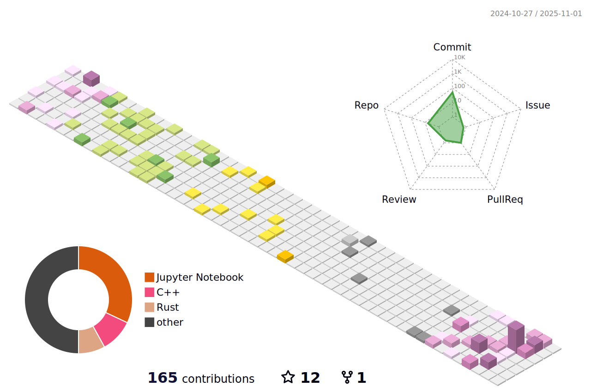

  

<h1 align="center">Shivam Varshney</h1>

  

  
  
  
  
  
  
  

---

## About
- 🧠 Competitive Programmer
- 📫 **shivamvarshney565@gmail.com**

---

## GitHub Snapshot

  
  

  

---

## Achievements

  

---

## Activity

  <!-- 3D calendar generated by your 3D workflow -->
  

  <!-- Snake generated by your snake workflow -->
  

