  

<h1 align="center">Shivam Varshney</h1>
<h3 align="center">Backend Developer · Competitive Programmer · Exploring Blockchain</h3>

  <a href="https://github.com/varshney565">GitHub</a> ·
  <a href="https://twitter.com/shivam56565">Twitter</a> ·
  <a href="https://linkedin.com/in/shivam565">LinkedIn</a> ·
  <a href="https://www.codechef.com/users/shivamloop">CodeChef</a> ·
  <a href="https://codeforces.com/profile/shivam565">Codeforces</a> ·
  <a href="https://www.leetcode.com/shivam565">LeetCode</a> ·
  <a href="https://auth.geeksforgeeks.org/user/varshney565">GeeksForGeeks</a>

---

## About
- 🌱 Exploring **Blockchain & Web3**
- 🧠 **Competitive Programming & DSA**
- 💬 Ask me about **Node.js**, **Rust**, backend scalability
- 📫 **shivamvarshney565@gmail.com**
- ⚡ I love solving coding problems

---

## Languages & Tools

  

---

## GitHub Snapshot

  
  

  

---

## Achievements

  

